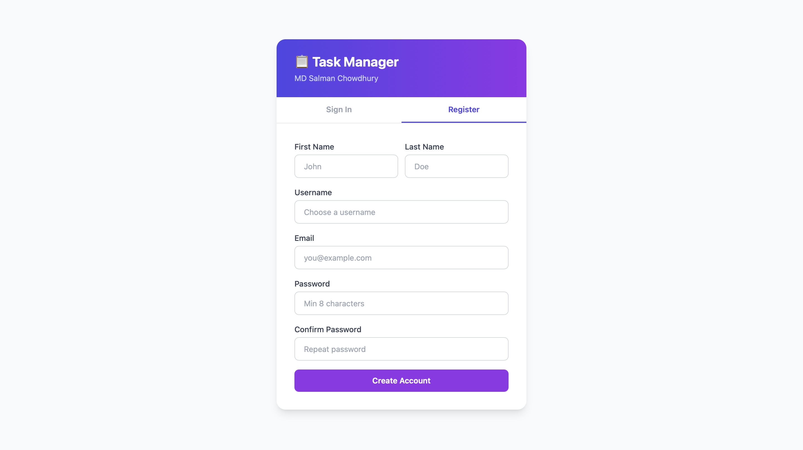
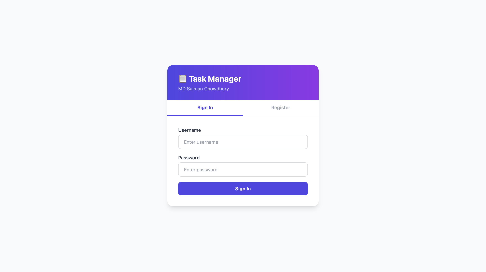
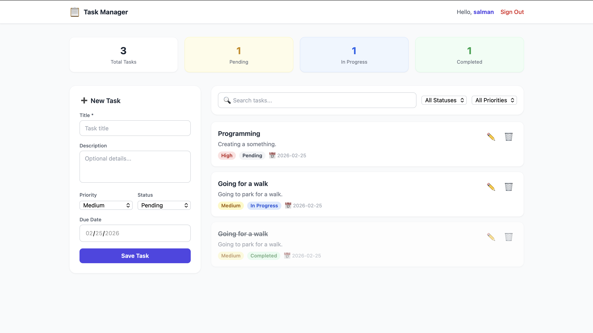
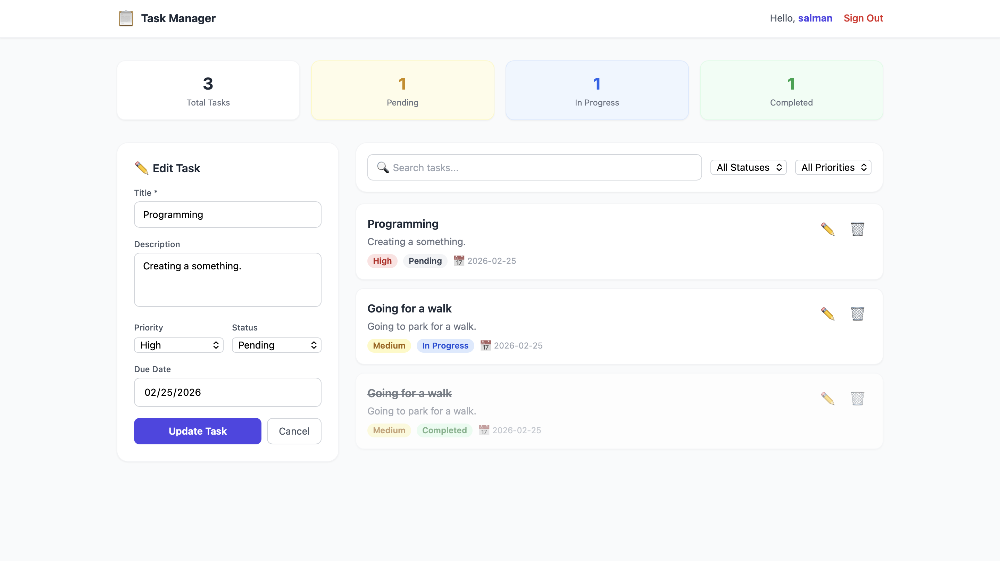

# 📋 Task Manager API

A full-featured **Task Management REST API** built with **Django** and **Django REST Framework**, featuring JWT authentication and an optional Tailwind CSS frontend.

## Screenshorts

Register

Login

Dashboard

Register



---

## ✨ Features

- 🔐 User Registration & JWT Login
- ✅ Full Task CRUD (Create, List, Retrieve, Update, Delete)
- 🔍 Search, filter by status/priority, and ordering
- 📊 Pagination on list endpoints
- 🌐 Optional Tailwind CSS frontend UI (at `/`)
- 🛡️ Users can only access their own tasks

---

## 🗂️ Project Structure

```
task_manager_api/
├── manage.py
├── requirements.txt
├── README.md
├── db.sqlite3              # Created on first migration
├── core/       # Django project settings
│   ├── settings.py
│   ├── urls.py
│   └── wsgi.py
├── accounts/               # Auth app (register, login, profile)
│   ├── models.py
│   ├── serializers.py
│   ├── views.py
│   └── urls.py
├── tasks/                  # Task CRUD app
│   ├── models.py
│   ├── serializers.py
│   ├── views.py
│   └── urls.py
└── frontend/
    └── index.html          # Tailwind CSS frontend
```

---

## ⚙️ Setup Instructions

### Prerequisites
- Python 3.10+
- pip

### 1. Clone the Repository

```bash
git clone https://github.com/MSCRAFI/task_manager_api.git
cd task-manager-api
```

### 2. Create a Virtual Environment

```bash
python -m venv venv
source venv/bin/activate        # On Windows: venv\Scripts\activate
```

### 3. Install Dependencies

```bash
pip install -r requirements.txt
```

### 4. Apply Migrations

```bash
python manage.py migrate
```

### 5. Create a Superuser (Optional — for Django Admin)

```bash
python manage.py createsuperuser
```

### 6. Run the Development Server

```bash
python manage.py runserver
```

The API is now available at `http://127.0.0.1:8000/`

---

## 🔌 API Endpoints

### 🔐 Authentication Endpoints

| Method        | Endpoint                   | Description                      | Auth Required |
| ------------- | -------------------------- | -------------------------------- | ------------- |
| `POST`        | `/api/auth/register/`      | Register a new user              | No            |
| `POST`        | `/api/auth/login/`         | Login and receive JWT tokens     | No            |
| `POST`        | `/api/auth/logout/`        | Logout (blacklist refresh token) | Yes           |
| `POST`        | `/api/auth/token/refresh/` | Refresh access token             | No            |
| `GET` / `PUT` | `/api/auth/profile/`       | View or update user profile      | Yes           |

---

### 📋 Task Endpoints

| Method   | Endpoint           | Description                    | Auth Required |
| -------- | ------------------ | ------------------------------ | ------------- |
| `GET`    | `/api/tasks/`      | List all tasks (paginated)     | Yes           |
| `POST`   | `/api/tasks/`      | Create a new task              | Yes           |
| `GET`    | `/api/tasks/<id>/` | Retrieve a single task         | Yes           |
| `PUT`    | `/api/tasks/<id>/` | Update a task (full update)    | Yes           |
| `PATCH`  | `/api/tasks/<id>/` | Update a task (partial update) | Yes           |
| `DELETE` | `/api/tasks/<id>/` | Delete a task                  | Yes           |

---

### 🔎 Query Parameters (List Endpoint)

| Parameter  | Example               | Description                                   |
| ---------- | --------------------- | --------------------------------------------- |
| `search`   | `?search=meeting`     | Search by title and description               |
| `status`   | `?status=pending`     | Filter tasks by status                        |
| `priority` | `?priority=high`      | Filter tasks by priority                      |
| `ordering` | `?ordering=-due_date` | Sort results (prefix with `-` for descending) |
| `page`     | `?page=2`             | Paginate results                              |


---

## 📨 Request / Response Examples

### Register
```http
POST /api/auth/register/
Content-Type: application/json

{
  "username": "salman",
  "email": "salman@example.com",
  "password": "securepassword123",
  "password2": "securepassword123"
}
```
**Response (201)**
```json
{
  "message": "User registered successfully.",
  "user": { "id": 1, "username": "salman", "email": "salman@example.com" },
  "tokens": { "refresh": "...", "access": "..." }
}
```

---

### Login
```http
POST /api/auth/login/
Content-Type: application/json

{
  "username": "salman",
  "password": "securepassword123"
}
```
**Response (200)**
```json
{
  "access": "eyJ...",
  "refresh": "eyJ...",
  "user": { "id": 1, "username": "salman", "email": "salman@example.com" }
}
```

---

### Create Task
```http
POST /api/tasks/
Authorization: Bearer <access_token>
Content-Type: application/json

{
  "title": "Finish internship assignment",
  "description": "Build a Task Manager API using DRF",
  "priority": "high",
  "status": "in_progress",
  "due_date": "2024-12-31"
}
```
**Response (201)**
```json
{
  "id": 1,
  "user": "salman",
  "title": "Finish internship assignment",
  "description": "Build a Task Manager API using DRF",
  "priority": "high",
  "status": "in_progress",
  "due_date": "2024-12-31",
  "created_at": "2024-11-01T10:00:00Z",
  "updated_at": "2024-11-01T10:00:00Z"
}
```

---

### List Tasks
```http
GET /api/tasks/?status=in_progress&priority=high
Authorization: Bearer <access_token>
```

---

### Update Task
```http
PATCH /api/tasks/1/
Authorization: Bearer <access_token>
Content-Type: application/json

{
  "status": "completed"
}
```

---

### Delete Task
```http
DELETE /api/tasks/1/
Authorization: Bearer <access_token>
```
**Response (200)**
```json
{ "message": "Task \"Finish internship assignment\" deleted successfully." }
```

---

## 🌐 Frontend UI

Open your browser at `http://127.0.0.1:8000/` to access the Tailwind CSS frontend.

It includes:
- Registration and Login forms
- Live task dashboard with stats (total, pending, in progress, completed)
- Create, edit, and delete tasks
- Search and filter tasks in real-time

---

## 🔒 Authentication Flow

This API uses **JWT (JSON Web Tokens)**:

1. Register or login to receive `access` and `refresh` tokens.
2. Include the access token in every authenticated request:
   ```
   Authorization: Bearer <access_token>
   ```
3. When the access token expires (1 hour), use the refresh token to get a new one via `POST /api/auth/token/refresh/`.

---

## 🛠️ Tech Stack

| Technology | Version |
|------------|---------|
| Python | 3.10+ |
| Django | 4.2+ |
| Django REST Framework | 3.14+ |
| Simple JWT | 5.3+ |
| SQLite | (default, built-in) |
| Tailwind CSS | CDN (frontend) |

---

## 📄 License

This project was built as part of a technical assessment.
